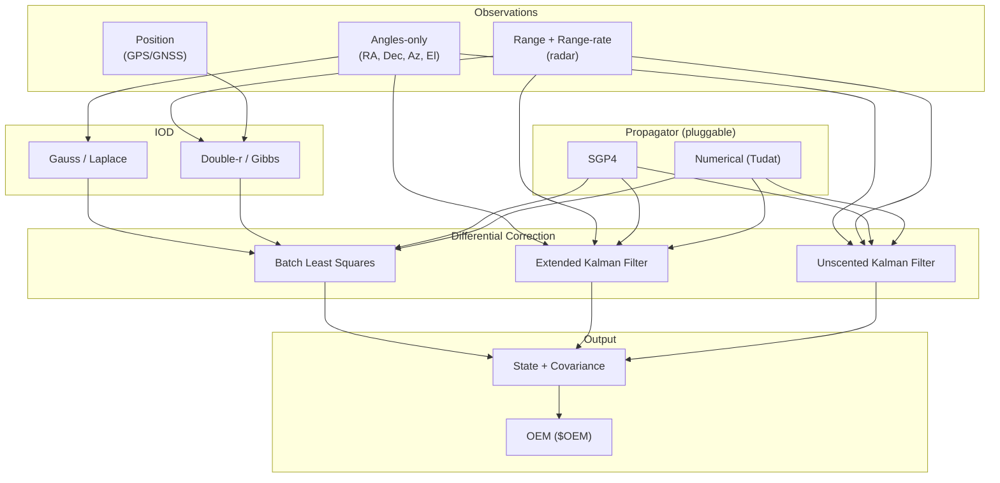

# 🎯 Orbit Determination Plugin

[](https://github.com/the-lobsternaut/od-sdn-plugin/actions)
[](LICENSE)
[](https://en.cppreference.com/w/cpp/17)
[](wasm/)
[](https://github.com/the-lobsternaut)

**Orbit determination from observations — IOD (Gauss, Laplace, Double-r, Gibbs), batch least squares, EKF/UKF sequential estimation, and covariance propagation with pluggable propagators.**

---

## Overview

The OD plugin determines orbital states from ground-based and space-based observations. It supports the full OD pipeline from initial orbit determination through refined differential correction.

### Methods

| Phase | Method | Input | Description |
|-------|--------|-------|-------------|
| **IOD** | Gauss | 3 angles-only obs | Classical angles-only initial orbit |
| **IOD** | Laplace | 3 angles-only obs | Alternative to Gauss |
| **IOD** | Double-r | 2 range+angles obs | When range measurements available |
| **IOD** | Gibbs | 3 position vectors | When positions known (e.g., GPS) |
| **IOD** | Herrick-Gibbs | 3 close positions | Small time separations |
| **DC** | Batch Least Squares | N observations | Weighted batch fit |
| **Sequential** | EKF | Streaming obs | Real-time state estimation |
| **Sequential** | UKF | Streaming obs | Handles nonlinearity better |

---

## Architecture



---

## Research & References

- Vallado, D. A. (2013). *Fundamentals of Astrodynamics and Applications*, 4th ed. Ch. 7 (IOD), Ch. 10 (Estimation).
- Tapley, B., Schutz, B., & Born, G. (2004). *Statistical Orbit Determination*. Elsevier. Definitive OD reference.
- Gauss, C. F. (1809). *Theoria Motus Corporum Coelestium*. Original IOD method.
- Julier, S. J. & Uhlmann, J. K. (2004). ["Unscented Filtering and Nonlinear Estimation"](https://doi.org/10.1109/JPROC.2003.823141). *Proceedings of the IEEE*. UKF theory.
- Montenbruck, O. & Gill, E. (2000). *Satellite Orbits*. Ch. 8 (orbit determination).

---

## Build Instructions

```bash
git clone --recursive https://github.com/the-lobsternaut/od-sdn-plugin.git
cd od-sdn-plugin

mkdir -p build && cd build
cmake ../src/cpp -DCMAKE_CXX_STANDARD=17
make -j$(nproc)
ctest --output-on-failure
```

---

## Usage Examples

```cpp
#include "od/orbit_determination.h"

// IOD from 3 angles-only observations
std::vector<od::Observation> obs = {
    {jd1, od::ObservationType::RIGHT_ASCENSION, 1.234, 0.001},
    {jd1, od::ObservationType::DECLINATION, 0.567, 0.001},
    {jd2, od::ObservationType::RIGHT_ASCENSION, 1.456, 0.001},
    // ...
};

od::GroundStation site = {0, "MIT", 42.36, -71.09, 0.02};
auto iod_result = od::gaussIOD(obs, site);

// Refine with batch least squares
od::BatchLSConfig config;
config.maxIterations = 20;
config.convergence = 1e-8;
auto refined = od::batchLeastSquares(obs, {site}, iod_result, config);

printf("State: [%.3f, %.3f, %.3f] km, Residual RMS: %.3f arcsec\n",
       refined.state.x, refined.state.y, refined.state.z, refined.rms * 206265);
```

---

## Plugin Manifest

```json
{
  "schemaVersion": 1,
  "pluginId": "orbit-determination",
  "pluginType": "analysis",
  "name": "Orbit Determination Plugin",
  "version": "0.1.0",
  "description": "Orbit determination with IOD (Gauss/Laplace/Double-r), batch least squares, and EKF/UKF estimation.",
  "license": "Apache-2.0",
  "inputs": ["$OBS", "$OEM"],
  "outputs": ["$OEM", "$COV"]
}
```

---

## License

Apache-2.0 — see [LICENSE](LICENSE) for details.

---

*Part of the [Space Data Network](https://github.com/the-lobsternaut) plugin ecosystem.*
